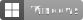

# Badges

Pre-generated badges from [Shields.io](https://shields.io/) to be included in READMEs of other repositories.

## Snippets

Use the following snippets to include the badges in READMEs.

### macOS


```

```

### Linux


```

```

### Windows



```

```

### Android


```

```

## Shields.io API URLs

The badges have been generated with the following [Shields.io](https://shields.io/) URLs.

### macOS

> <https://img.shields.io/badge/macOS-lightgray?labelColor=black&logoColor=white&logo=apple>

### Linux

> <https://img.shields.io/badge/Linux-orange?labelColor=red&logo=data:image/svg%2bxml;base64,PHN2ZyB4bWxucz0iaHR0cDovL3d3dy53My5vcmcvMjAwMC9zdmciIHdpZHRoPSIzOTkuMjM1IiBoZWlnaHQ9IjQ2My42OTkiIHZpZXdCb3g9IjAgMCAzNzQuMjg0IDQzNC43MTciIGZpbGw9IiNmZmYiIHhtbG5zOnY9Imh0dHBzOi8vdmVjdGEuaW8vbmFubyI+PHBhdGggZD0iTTE4Ny4xNDIgMTYuMDc4bC00LjE4NC4wMTRjLTMwLjQwMi45MzUtNjEuMzMgNy42OS04Mi4xNjMgMzYuNTQzLTIyLjc0NyAzMS41MDQtMTYuNDQ4IDU5Ljg3OS0xNy4zNTggNjkuODkyUzE0LjQ4NSAyNDkuMDgyIDIzLjU0MiAyNjUuNzE5YzUuMDYyIDkuMjk4IDI3LjU4MS01LjU1MiAyOC4wMzYgNy42NDdTMjkuNTcgNDE4LjY0IDE4NS45NzMgNDE4LjY0aDEuMTY3IDEuMTc2YzE1Ni40MDQgMCAxMzMuOTM2LTEzMi4wNzYgMTM0LjM5MS0xNDUuMjc0czIyLjk3NCAxLjY1MSAyOC4wMzYtNy42NDdjOS4wNTctMTYuNjM4LTU4Ljk4My0xMzMuMTgtNTkuODkzLTE0My4xOTNzNS4zODYtMzguMzg2LTE3LjM2LTY5Ljg5MmMtMjAuODMzLTI4Ljg1My01MS43Ni0zNS42MS04Mi4xNjMtMzYuNTQ1LTEuNTgxIDAtMi43NjgtLjAxMi00LjE4NC0uMDEyem0tNTAuNTEzIDY3Ljk4M2ExNS4xMyAxNS4xMyAwIDAgMSAxLjcwMS4wMDRjOC45MDQuNTI5IDEwLjcyNiAxMC4wNDcgMTEuMTQ0IDE5LjE0My4zNDIgNy40MTktLjAwOCAxMy45NDUtMi43MTggMTguODEycy02LjQ1NCA3Ljg3Ny0xMC41ODkgNy44NzctNy44NzYtMy4wMS0xMC41ODctNy44NzctNC4yMzktMTEuNTk0LTQuMzg3LTE5LjAxOWMtLjIxNy0xMC45MjIgNy4wMDMtMTguNDg1IDE1LjQzNS0xOC45NHptMTAwLjczNCAwYzguNDMzLjQ1NSAxNS42NSA4LjAxOCAxNS40MzMgMTguOTQtLjE0OCA3LjQyNi0xLjY3NCAxNC4xNTEtNC4zODQgMTkuMDE5cy02LjQ1NCA3Ljg3Ny0xMC41ODkgNy44NzctNy44NzgtMy4wMTEtMTAuNTg5LTcuODc3LTMuMDYtMTEuMzkzLTIuNzE4LTE4LjgxMmMuNDE4LTkuMDk2IDIuMjQtMTguNjE0IDExLjE0NC0xOS4xNDNoLjAwMmMuNTcxLS4wMzQgMS4xMzktLjAzNSAxLjcwMS0uMDA0em0tMTEwLjgxIDcxLjkzMWMxNS4zODEtLjQ5NCA0NC40MTEgMjEuNzU5IDU3LjY0NCAyNi4xNDggMS40MTMuMzc4IDEuOTI0LjY4NiAyLjk0NS42ODZzMS42MTYtLjMzIDIuOTQ1LS42ODZjMTMuNzA1LTQuNTQzIDQ0LjM2Mi0yOC4yNTkgNTkuMjQyLTI2LjAwNiAxNi40NDkgMi40OSAyLjgxMiAyNy4xNzcgOS44MjEgNDUuMzI2IDE3LjY0MSA0NS42ODIgNDEuMzQ3IDExNi40NTMgMTYuMDQ0IDE1Ny42NDgtNy44NjYgMTIuODA3LTI2LjE0NCAzNC43ODctODMuOTYyIDM1LjUxMmwtNC4wOS4wMjYtNC4wOS0uMDI2Yy01Ny44MTUtLjcyNi03Ni4wOTEtMjIuNzA1LTgzLjk1Ny0zNS41MTItMjUuMzAzLTQxLjE5NS0xLjU5Ni0xMTEuOTY2IDE2LjA0NC0xNTcuNjQ4IDcuMDA5LTE4LjE0OS02LjYyOC00Mi44MzYgOS44MjEtNDUuMzI2LjUyOC0uMDc4IDEuMDYtLjEyNSAxLjU5NC0uMTR6Ii8+PHBhdGggZD0iTTUyLjQwNCAzNzguMjUxYy41NDIgNy44MDUgMTEuNzA2IDE4LjM2OCAyMC44OTcgMTkuMjkxIDI2LjU4OCAyLjY3IDY1LjcxNyAyNy4yMDcgODUuMjg5IDEuNjIxIDE1Ljk5Ny0yNS44NzItMTAuMTY5LTQyLjE1NC0xNy4zMzYtNjkuMjI5LTMuMTQtMTEuODUzLTUuMTM0LTIyLjg1OS0xNi4zNDItMjUuMzItMTMuNzE0LTMuMDExLTE4LjY1OCAxMC4xNDEtMjYuNjI1IDEzLjQwNi03LjI2NCAyLjk3Ny0yNC4wNTctNi4wMzktMzIuNDYxIDIuMTUxLTEwLjY3IDEwLjYzOC0uMzMzIDIzLjQyNy0xLjU1NyAzNC44NjMtLjk2NiA5LjAyMi0xMi42NTcgMTEuNzctMTEuODYzIDIzLjIxOHptMjcyLjA5MyAwYy0uNTQyIDcuODA1LTExLjcwNiAxOC4zNjgtMjAuODk3IDE5LjI5MS0yNi41ODggMi42Ny02NS43MTcgMjcuMjA3LTg1LjI4OSAxLjYyMS0xNS45OTctMjUuODcyIDEwLjE2OS00Mi4xNTQgMTcuMzM2LTY5LjIyOSAzLjE0LTExLjg1MyA1LjEzNC0yMi44NTkgMTYuMzQyLTI1LjMyIDEzLjcxNC0zLjAxMSAxOC42NTggMTAuMTQxIDI2LjYyNSAxMy40MDYgNy4yNjQgMi45NzcgMjQuMDU3LTYuMDM5IDMyLjQ2MSAyLjE1MSAxMC42NyAxMC42MzguMzMzIDIzLjQyNyAxLjU1NyAzNC44NjMuOTY2IDkuMDIyIDEyLjY1NyAxMS43NyAxMS44NjMgMjMuMjE4eiIgc3Ryb2tlPSIjZmZmIiBzdHJva2Utd2lkdGg9IjEzLjYxIi8+PC9zdmc+>

Use of Base64-encoded custom logo as explained in [Shields.io documentation](https://shields.io/docs/logos#custom-logos). The used logo is [`linux-logo.svg`](resources/linux-logo.svg) and has been obtained from <https://ecogex.com/the-other-linux-logo/>.

### Windows

> <https://img.shields.io/badge/Windows-lightblue?labelColor=blue&&logoColor=white&logo=windows>

### Android

> <https://img.shields.io/badge/Android-lightgreen?labelColor=green&&logoColor=white&logo=android>
